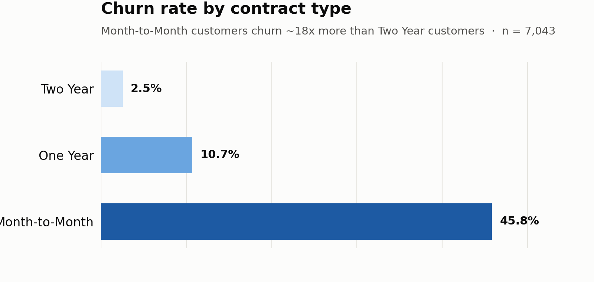
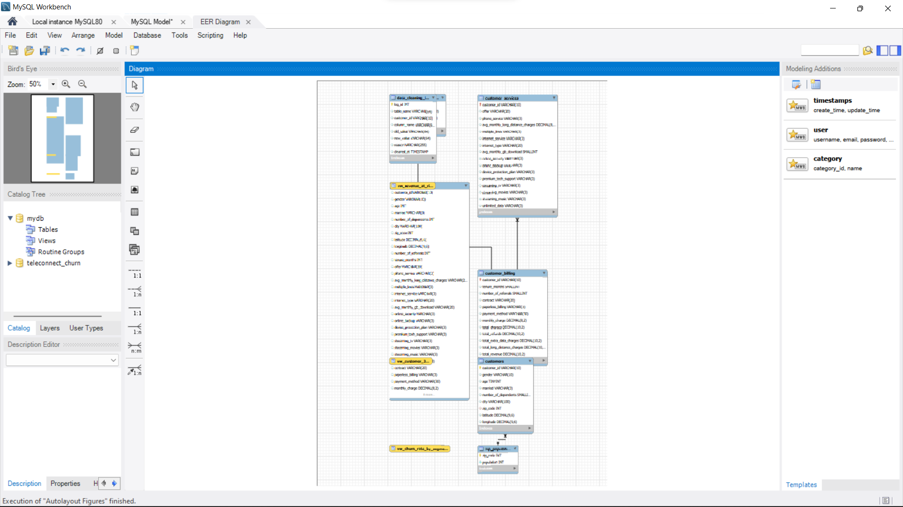

# TeleConnect Customer Churn and Revenue Risk Analysis

An end-to-end MySQL portfolio project that examines customer churn, customer value, service adoption, and retention priorities for a fictional telecommunications company serving 7,043 customers in California.



## Project objective

TeleConnect needs to understand how many customers have left, which customer groups experience the highest churn, why customers leave, how much historical revenue is associated with churned customers, and which active customers should receive retention attention.

The project converts a flat customer CSV into a normalized relational database, validates data quality, answers business questions with SQL, and packages recurring analysis into reusable views.

## Dataset

The project uses the Maven Analytics Telecom Customer Churn dataset, based on IBM's fictional telecommunications sample.

- 7,043 customer records
- 38 customer-level fields
- 1,671 ZIP-code population records
- Customer demographics, location, services, billing, status, and churn reasons
- Snapshot corresponding to the end of Q2 2022

Source: [Maven Analytics Telecom Customer Churn](https://mavenanalytics.io/data-playground/telecom-customer-churn)

License: Public Domain, as stated on the Maven Analytics dataset page.

## Tools and SQL techniques

- MySQL Server 8.0
- MySQL Workbench 8.0 CE
- Relational schema design and normalization
- Staging-table ETL pattern
- Data-quality validation
- Joins and conditional aggregation
- Subqueries and common table expressions
- Window functions including `NTILE`, `RANK`, and running `SUM`
- Reusable SQL views

## Database design

The flat customer file was normalized into five core tables:

| Table | Purpose |
| --- | --- |
| `customers` | Customer demographics and location |
| `customer_services` | Phone, internet, streaming, and support services |
| `customer_billing` | Tenure, contract, payment method, charges, and historical revenue |
| `customer_churn_status` | Customer status, churn category, and churn reason |
| `zip_population` | Population by California ZIP code |



## Business questions

1. What is the overall churn rate?
2. Which contract types, payment methods, and internet services have the highest churn?
3. What reasons do customers give for leaving?
4. How does tenure differ between customers who stayed and churned?
5. How much historical revenue was generated by customers who later churned?
6. How does churn vary across historical-revenue quartiles?
7. Which locations show concentrated churn?
8. How is add-on adoption associated with churn?
9. Which active customers meet a transparent priority-retention rule?

## Key findings

- 1,869 of 7,043 customers were classified as churned, producing a 26.54% rate across all customers. The rate is 28.37% when 454 newly joined customers are excluded from the denominator.
- Month-to-Month customers had a 45.84% churn rate, compared with 10.71% for One Year and 2.55% for Two Year contracts.
- Fiber Optic customers had the highest internet-type churn rate at 40.72%.
- Mailed Check customers recorded 36.88% churn and Bank Withdrawal customers 34.00%, compared with 14.48% for Credit Card.
- Customers in their first 12 months had a 59.87% churn rate. Customers with 49 or more months of tenure had a 9.51% rate.
- Competitor-related reasons accounted for 841 churned customers, or 45.00% of churn.
- Churn fell from 63.54% among internet customers with no selected support add-ons to 5.32% among customers with all four measured add-ons. This is an association and does not by itself prove that add-ons cause retention.
- Churned customers had generated $3,684,459.82 in cumulative historical revenue. This is not a forecast of future revenue loss.
- A rule-based segment identified 442 active Month-to-Month customers whose historical revenue was above the company average. The segment supports retention targeting but is not a predictive churn score.

## Data-quality decisions

- No duplicate customer IDs were found.
- Every customer ZIP code matched the population reference table.
- Every churned customer had a recorded churn reason.
- The stored total-revenue formula reconciled for all 7,043 rows.
- 120 negative monthly-charge values were found. The source does not provide enough evidence to reconstruct the true charge, so the portfolio scripts preserve and flag them rather than converting them to positive values. Monthly-charge averages exclude these anomalies.
- Service-related nulls were retained when the related service did not apply.

See [Data Cleaning and Validation](documentation/data_cleaning_and_validation.md) for the full treatment.

## Repository structure

```text
TeleConnect-Customer-Churn-SQL-Analysis/
|-- README.md
|-- sql/
|   |-- 01_schema.sql
|   |-- 02_load_data.sql
|   |-- 03_data_cleaning_and_validation.sql
|   |-- 04_basic_queries.sql
|   |-- 05_advanced_queries.sql
|   `-- 06_views.sql
|-- data/
|-- results/
|-- screenshots/
|-- charts/
|-- documentation/
`-- database/
```

## How to run the project

1. Open MySQL Workbench and connect to MySQL Server 8.0.
2. Run `sql/01_schema.sql`.
3. Place the two source CSV files in the folder returned by `SHOW VARIABLES LIKE 'secure_file_priv';`.
4. Update the two file paths in `sql/02_load_data.sql` and run it.
5. Run `sql/03_data_cleaning_and_validation.sql`.
6. Run `sql/04_basic_queries.sql` and `sql/05_advanced_queries.sql`.
7. Run `sql/06_views.sql`.

`01_schema.sql` drops and recreates the `teleconnect_churn` database. Use it only in a project environment where replacing that schema is intended.

## Evidence

The `screenshots` folder contains genuine MySQL Workbench evidence showing the database objects, EER diagram, churn-rate query, window-function analysis, and priority-retention query. The `results` folder contains CSV exports for the reported results.

## Limitations

- The data is a single-quarter snapshot, so it does not measure changes through time.
- The analysis identifies associations, not causal relationships.
- The priority-retention segment is rule-based rather than predictive.
- Historical revenue is not the same as recurring revenue lost after churn.
- Negative monthly-charge records remain unresolved source anomalies.

## Author

Ernest-Cyril Divine Onyeze

[Portfolio](https://cyrilanalytics.com) | [GitHub](https://github.com/Ernest-Cyril)
